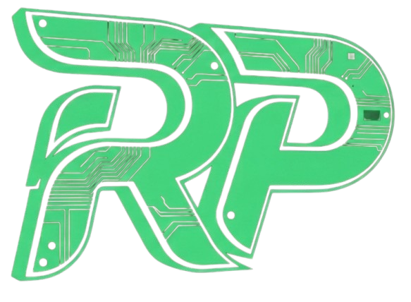
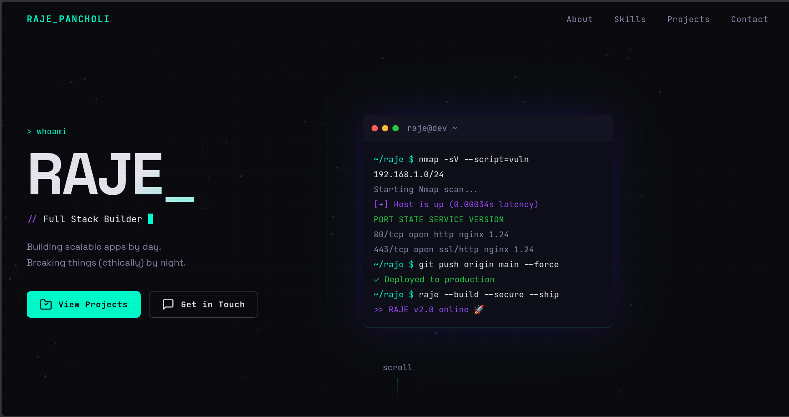
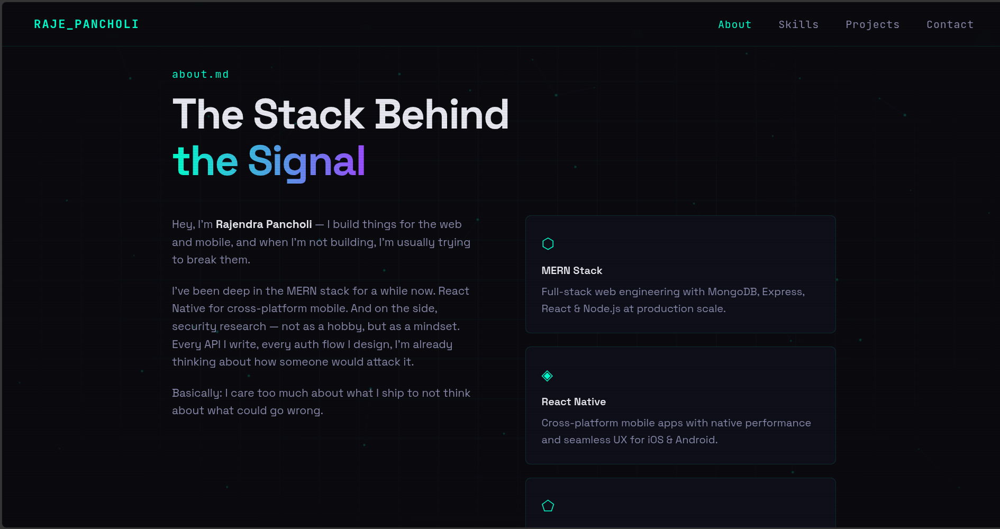
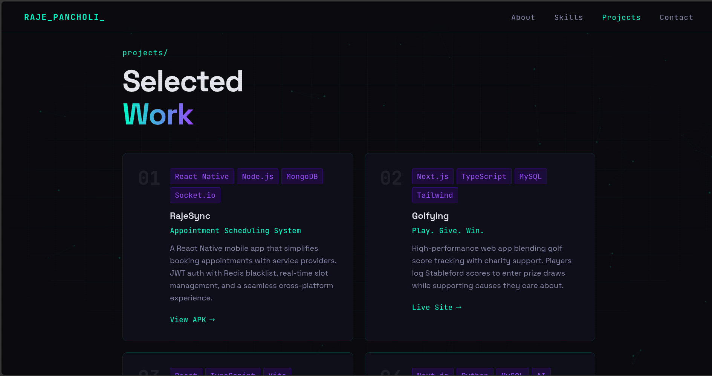
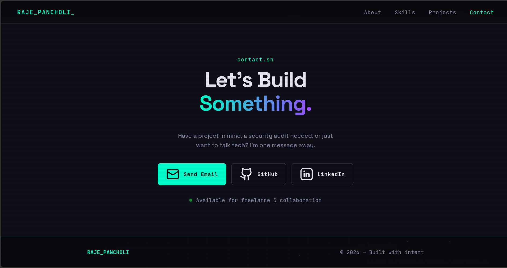

<h1 align="center">
  <a href="https://rajendrapancholi.github.io/">
    
  </a>
  <p>RAJENDRA PANCHOLI - Personal Portfolio</p>
</h1>

<p align="center">
<a href="#"></a>
<a href="#"></a>
<a href="#"></a>
<a href="#"></a>
<a href="#"></a>
</p>

<p align="center">
  <a href="#overview">Overview</a> •
  <a href="#features">Features</a> •
  <a href="#structure">Structure</a> •
  <a href="#setup">Setup</a> •
  <a href="#deployment">Deployment</a> •
  <a href="#preview">Preview</a> •
  <a href="#license">License</a> •
  <a href="#contact">Contact</a>
</p>

---

## Overview

Personal developer portfolio for **Rajendra Pancholi** — MERN Stack Developer, React Native Engineer, and Cybersecurity Researcher. Built with zero frameworks, zero dependencies — pure HTML, CSS, and JavaScript.

Designed with a dark hacker aesthetic: animated particle network, live terminal, typed role cycling, scroll-triggered reveals, and a subtle grid background. Fast, lightweight, and fully static.

---

## Features

- Animated particle canvas background with connecting node lines
- Scrolling grid background with drift animation
- Typed text cycling through roles in the hero
- Live terminal window that auto-types and loops
- Scroll-triggered reveal animations on all sections
- Glitch effect on hero name hover
- Magnetic hover on CTA buttons
- Active nav link tracking on scroll
- Mobile responsive with hamburger nav
- Dynamic copyright year via JavaScript
- Scanline overlay for CRT aesthetic
- Zero build step — open `index.html` and it works

---

## Structure

```
rajendrapancholi/
├── index.html      # Markup & section structure
└── style.css       # All styles, animations, responsive
├── script.js       # Typed text, terminal, particles, scroll logic
├── LICENSE
├── logo3.ico
├── logo.png
├── README.md
```

---

## Setup

No install needed. Just clone and open:

```bash
git clone https://github.com/rajendrapancholi/rajendrapancholi.github.io.git
cd rajendrapancholi.github.io
open index.html
```

Or serve locally with any static server:

```bash
npx serve .
# or
python3 -m http.server 3000
```

Visit `http://localhost:3000`.

---

## Deployment

This site is deployed via **GitHub Pages** at [`https://rajendrapancholi.github.io`](https://rajendrapancholi.github.io).

### To deploy your own copy:

1. Create a GitHub repo named exactly `rajendrapancholi.github.io`
2. Push these three files to the `main` branch root
3. Go to **Settings → Pages → Source**: `main` / `root`
4. Wait ~1 minute — live at `https://rajendrapancholi.github.io`

No build step. No CI. Just push.

---

## Preview

<table>
  <tr>
    <td></td>
    <td></td>
  </tr>
  <tr>
    <td></td>
    <td></td>
  </tr>
</table>

---

## License

This project is under the MIT License.
See the [LICENSE](LICENSE) file for details.

---

## Contact

* **Developer:** Rajendra Pancholi
* **Email:** [rpancholi522@gmail.com](mailto:rpancholi522@gmail.com)* **GitHub:** [https://github.com/rajendrapancholi](https://github.com/rajendrapancholi)
* **LinkedIn:** [https://www.linkedin.com/in/rajendra-pancholi](https://www.linkedin.com/in/rajendra-pancholi-11a3a5286)
* **Live Site:** [https://rajendrapancholi.github.io](https://rajendrapancholi.github.io)
